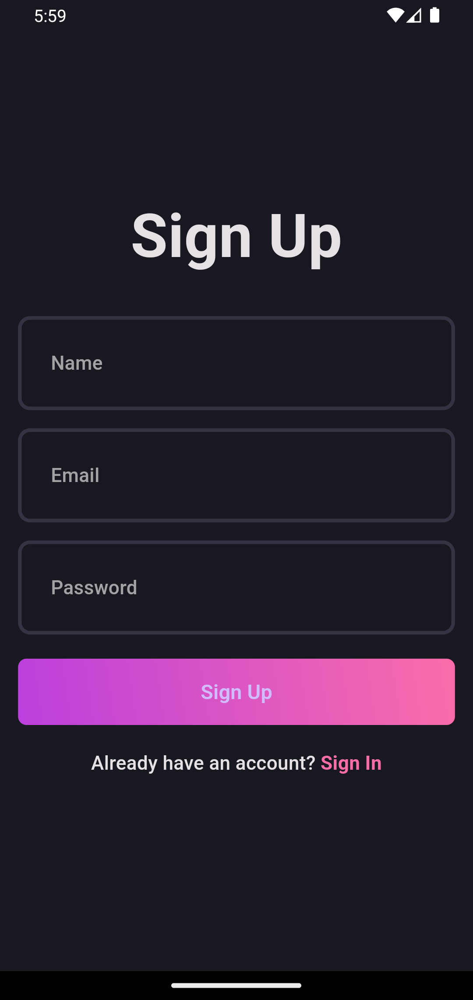
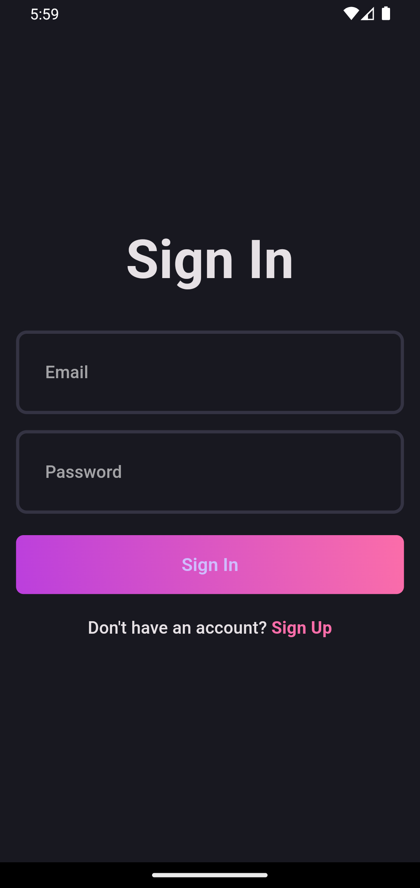
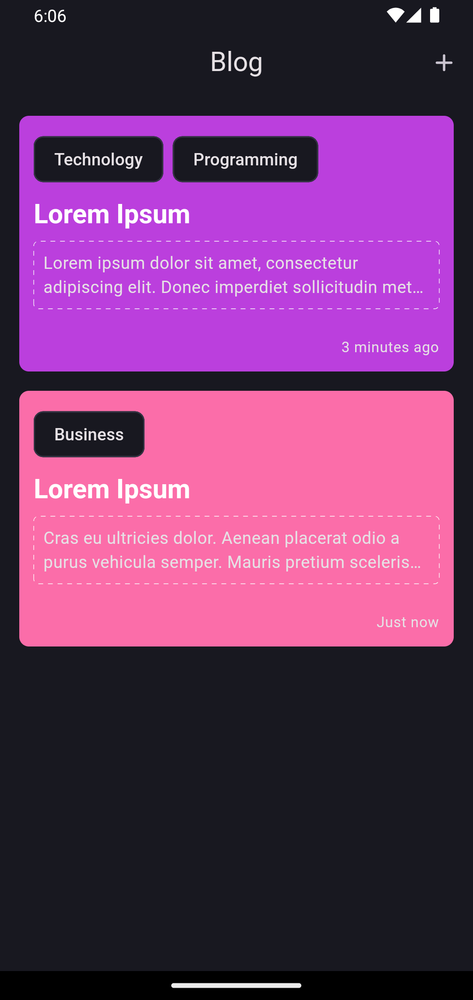
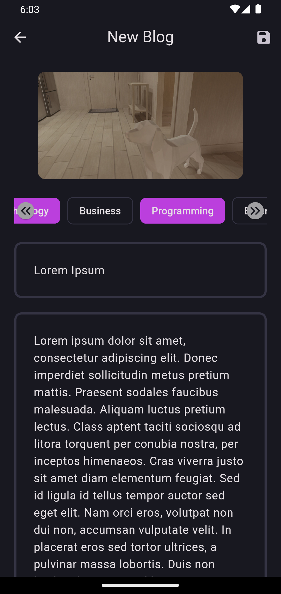
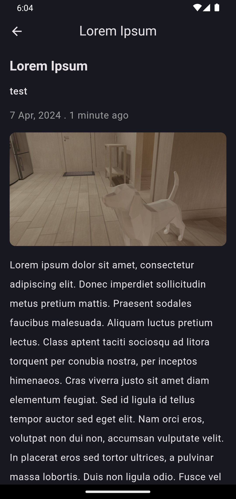

# FLUTTER BLOG APP

This is a Flutter blog app that follows the **`Clean Architecture`** and **`SOLID principles`**. The app allows users to sign up, log in, create, and view blogs. The app uses **`Supabase`** as the **_backend_**. Local data is **_cached_** using **`Hive`**. The app also uses **`Easy Localization`** for **_localization_** and **`Internet Connection Checker`** to **_check for internet connectivity_**. The app follows the **`BLoC`** pattern for **_state management_** and uses **`GetIt`** for **_dependency injection_**.

## Table of Contents 📎

- [Screenshots 📸](#screenshots-)
- [Clean Architecture 🏗](#clean-architecture-)
- [Features 🎉](#features-)
- [SOLID Principles 🌟](#solid-principles-)
- [Clean Architecture + SOLID Principles 🚀](#clean-architecture--solid-principles-)
- [Getting Started 🚀](#getting-started-)
  - [Prerequisites 📋](#prerequisites-)
  - [Installation 🔧](#installation-)
  - [Packages 📦](#packages-)
- [Thanks 🙏](#thanks-)

## Screenshots 📸

|                                                     |                                                                 |                                              |
| :-------------------------------------------------: | :-------------------------------------------------------------: | :------------------------------------------: |
|   SignUp   |          LogIn          |  Blogs |
|  NewBlog |  BlogDetails |                                              |

## Clean Architecture 🏗

The Clean Architecture is a software design philosophy that separates the software into layers. Each layer has its own responsibilities and dependencies. The layers are:

- **Domain**: This layer contains the business logic of the application. It is the innermost layer and does not depend on any other layer. It contains entities, use cases, and repositories.
- **Data**: This layer contains the implementation of the repositories. It depends on the domain layer.
- **Presentation**: This layer contains the UI of the application. It depends on the domain layer.

The Clean Architecture allows for the separation of concerns and makes the codebase more maintainable and testable.

## Features 🎉

- **Authentication**: Users can sign up and log in to the app.
- **Blogs**: Users can create and view blogs.

## SOLID Principles 🌟

The SOLID principles are a set of five design principles that help make software designs more understandable, flexible, and maintainable. The principles are:

- **Single Responsibility Principle (SRP)**: A class should have only one reason to change.
- **Open/Closed Principle (OCP)**: Software entities should be open for extension but closed for modification.
- **Liskov Substitution Principle (LSP)**: Objects of a superclass should be replaceable with objects of its subclasses without affecting the functionality of the program.
- **Interface Segregation Principle (ISP)**: A client should not be forced to implement an interface that it does not use.
- **Dependency Inversion Principle (DIP)**: High-level modules should not depend on low-level modules. Both should depend on abstractions. Abstractions should not depend on details. Details should depend on abstractions.

The SOLID principles help make software designs more modular, flexible, and maintainable.

## Clean Architecture + SOLID Principles 🚀

The Clean Architecture and SOLID principles work well together. The Clean Architecture provides a structure for the software, while the SOLID principles provide guidelines for writing clean and maintainable code. By following the Clean Architecture and SOLID principles, developers can create software that is easy to understand, test, and maintain.

## Getting Started 🚀

### Prerequisites 📋

- [Flutter](https://flutter.dev/docs/get-started/install)
- [Dart](https://dart.dev/get-dart)

### Installation 🔧

1. Clone the repository:

```bash
git clone
```

2. Navigate to the project directory:

```bash
cd flutter_blog_clean_arc_app
```

3. Install the dependencies:

```bash
flutter pub get
```

4. Create a `assets/env/.env` and `assets/env/.dev.env` file in the root directory and add the following:

```env
SupabaseUrl=YOUR_SUPABASE_URL
SupabaseAnonKey=YOUR_SUPABASE_ANON_KEY
SupabaseServiceRoleKey=YOUR_SUPABASE_SERVICE_ROLE_KEY
```

5. Supabase:

- Auth > Enable Email & Password
- Database > profiles > SQL > Run the following query:

```sql
create table profiles (
  id uuid references auth.users on delete cascade not null primary key,
  updated_at timestamp with time zone,
  name text,

  constraint name_lenght check (char_length(name) >= 2)
);

alter table profiles
  enable row level security;

create policy "Public profiles are viewable by everyone." on profiles
  for select using (true);

create policy "Users can insert their own profile." on profiles
  for insert with check (auth.uid() = id);

create policy "Users can update own profile." on profiles
  for update using (auth.uid() = id);

create function public.handle_new_user()
returns trigger as $$
begin
  insert into public.profiles (id, name)
  values (new.id, new.raw_user_meta_data->>'name');
  return new;
end;
$$ language plpgsql security definer;
create trigger on_auth_user_created
  after insert on auth.users
  for each row execute procedure public.handle_new_user();
```

- Database > blogs > SQL > Run the following query:

```sql
create table blogs (
  id uuid not null primary key,
  updated_at timestamp with time zone,
  owner_user_id uuid not null,
  title text not null,
  content text not null,
  image_url text,
  topics text array,
  foreign key (owner_user_id) references public.profiles(id)
);

alter table profiles
  enable row level security;

create policy "Public blogs are viewable by everyone." on blogs
  for select using (true);

create policy "Users can insert their own blogs." on blogs
  for insert with check (auth.uid() = id);

create policy "Users can update own blogs." on blogs
  for update using (auth.uid() = id);

insert into storage.buckets (id, name)
  values ('blog_images', 'blog_images');

create policy "Avatar images are publicly accessible." on storage.objects
  for select using (bucket_id = 'blog_images');

create policy "Anyone can upload an avatar." on storage.objects
  for insert with check (bucket_id = 'blog_images');

create policy "Anyone can update their own avatar." on storage.objects
  for update using (auth.uid() = owner) with check (bucket_id = 'blog_images');
```

- Storage > Create a bucket with the name `blog_images`

6. Run the app:

```bash
flutter run
```

### Packages 📦

- UI 📱
  - [dotted_border](https://pub.dev/packages/dotted_border)
- State Management 🚀
  - [flutter_bloc](https://pub.dev/packages/flutter_bloc)
  - [bloc](https://pub.dev/packages/bloc)
- Serialization 📦
  - [equatable](https://pub.dev/packages/equatable)
- Dependency Injection 💉
  - [get_it](https://pub.dev/packages/get_it)
- Network 🌐
  - [http](https://pub.dev/packages/http)
  - [supabase_flutter](https://pub.dev/packages/supabase_flutter)
  - [internet_connection_checker](https://pub.dev/packages/internet_connection_checker)
- Security 🔒
  - [flutter_dotenv](https://pub.dev/packages/flutter_dotenv)
- Localization 🌍
  - [easy_localization](https://pub.dev/packages/easy_localization)
- Cache 📦
  - [hive](https://pub.dev/packages/hive)
  - [isar_flutter_libs](https://pub.dev/packages/isar_flutter_libs)
- Utils 🛠
  - [image_picker](https://pub.dev/packages/image_picker)
  - [uuid](https://pub.dev/packages/uuid)
  - [path_provider](https://pub.dev/packages/path_provider)
- Analysis 📊
  - [very_good_analysis](https://pub.dev/packages/very_good_analysis)
- Code Generation 🏗
  - [build_runner](https://pub.dev/packages/build_runner)

## Thanks 🙏

-  [Rivaan Ranawat](https://github.com/RivaanRanawat) for the [Blog App](https://github.com/RivaanRanawat/blog-app-clean-architecture)
  - [YouTube](https://youtu.be/ELFORM9fmss?si=IaxA5ABicNjkStBP)
